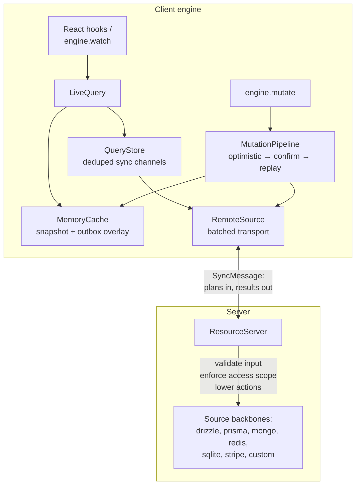

# ResourceKit internals

How the library works, for the curious and for contributors. The README covers what ResourceKit does; this document covers how.

## Architecture at a glance



Everything communicates through one shared vocabulary: **plans**.

## The plan IR

Every read and write becomes a small serializable object. The plan schemas in `src/plan/` _are_ the sync protocol - `plan.test.ts` holds golden fixtures, and changing a shape means bumping the protocol's `schemaVersion`, not editing a fixture.

```ts
// reads
{ type: "read", resource: "issues", op: "one",   id: "iss_1" }
{ type: "read", resource: "issues", op: "where", filter: { workspaceId: "w1" } }

// writes
{ type: "write", resource: "issues", op: "create", record: { … } }
{ type: "write", resource: "issues", op: "patch",  id: "iss_1", patch: { title: "…" } }
{ type: "write", resource: "issues", op: "delete", id: "iss_1" }
{ type: "write", resource: "issues", op: "action", action: "assign", id: "iss_1", input: { … } }
```

Two properties matter:

- **Writes address one record by identity.** Bulk writes can't be expressed; anything bigger is an explicit action.
- **Action plans carry intent, not effects.** The patch is derived from `(input, record)` on each side - the client lowers against its optimistic cache, the server against canonical data - so a stale client can never bake a wrong patch into the wire.

## The filter language and its algebra

The `where` filter supports equality, membership (`in`), and ranges (`gt/gte/lt/lte`) - nothing else. Its job is to describe _which set of records to sync_, not to answer rich questions; those run locally (next section). This is the boundary that keeps ResourceKit from growing into an ORM: the server only ever sees coarse set requests.

One condition algebra (`src/plan/filters.ts`) backs three features:

| Function                       | Question it answers                          | Used by                |
| ------------------------------ | -------------------------------------------- | ---------------------- |
| `matchesFilter(record, f)`     | does this record match?                      | local query evaluation |
| `filterSubsumes(coarse, fine)` | is every `fine` match also a `coarse` match? | coverage               |
| `intersectFilters(a, b)`       | what matches both (or provably nothing)?     | access scopes          |

## Queries: sync key + local refinements

`issues.where({ workspaceId })` produces the serializable plan - the **sync key**. Everything chained after it is a **refinement**: plain TypeScript that runs against the local cache and never crosses the wire.

```ts
issues
  .where({ workspaceId }) // sync key → wire
  .filter((i) => i.score > 80) // refinement → local
  .orderBy("updatedAt", "desc") // refinement → local
  .limit(50); // refinement → local
```

Queries that share a sync key share one network channel, however different their refinements - so ten components filtering the same workspace differently cost one request.

Two more chainables extend the plan itself:

- **`.take(n, field?, direction?)`** windows the _synced set_: only the top `n` records by the order travel and are cached. Windowed sets are never reported as `complete` (the window's edge can always have moved), and ingesting them never deletes records beyond the window.
- **`.include(...relations)`** joins related records in locally. Relations are declared on the resource (`relations: { project: one(() => projects, "projectId"), comments: many(() => comments, "issueId") }`); the runtime derives an `in`-filter plan for the related set, syncs it through an ordinary deduplicated channel, and hash-joins on every recompute - so joins stay live when either side changes. Relation targets are lazy thunks so modules can reference each other; _mutually_ recursive relation pairs defeat TypeScript inference, so keep the declared graph acyclic (or annotate one side).

## Named queries

For reads the wire filter language shouldn't express - text search, reports, aggregates, external APIs - a resource declares typed named queries and the server implements them:

```ts
queries: { search: namedQuery(z.object({ text: z.string() }), z.array(IssueSchema)) }
// serve config:
queries: { search: async ({ input, ctx }) => … }   // required when declared
```

Inputs are validated client-side before shipping and server-side again; outputs are validated (and stripped) against the declared schema, so the client types are guaranteed. Results cache locally as snapshots per input - repeating a query is free until refreshed. Array outputs come back as refinable collections. Named queries skip the automatic access-scope filter (results are arbitrary); the implementation receives `ctx` and enforces its own rules.

## Coverage

The cache records which sets have been fully synced. Subsumption makes this powerful: once `{ workspaceId: "w1" }` is synced, the query `{ workspaceId: "w1", status: "open" }` is provably complete locally - the local evaluator can do the narrowing - and never needs the network. Every read reports its coverage (`"complete" | "partial" | "unknown"`), and `engine.query` skips the server entirely when coverage is complete.

## Resource modes

Not every resource is a table. The `mode` tells the cache how to behave:

| Mode                   | Local behavior                                     | Example                |
| ---------------------- | -------------------------------------------------- | ---------------------- |
| `collection` (default) | records by id, locally queryable, coverage-tracked | Postgres rows          |
| `document`             | one record by id, editable                         | a Redis hash, settings |
| `snapshot`             | whole results cached by plan, replaced wholesale   | a report               |
| `blob`                 | content by id, loaded on demand                    | an S3 body             |
| `connection`           | never cached - online only                         | a live feed            |

## Backbones

A backbone executes plans. There are two contracts (`src/core/backbone.ts`):

- **`SourceBackbone`** - authoritative data. On the client this is the sync transport; on the server it's one of the built-in adapters - Drizzle, Prisma, `bun:sqlite`, MongoDB, Redis, Stripe, memory - or your own. Adapters implement only the five primitive ops (`one / where / create / patch / delete`) because the server runtime handles everything else first. Each built-in takes a client/handle you already have (a Mongo collection, a Redis client) via a structural type, so the library bundles no database driver.
- **`CacheBackbone`** - local state: `read` (with coverage), `ingest` (merge an authoritative result), `enqueue`/`settle` (the optimistic write lifecycle), and change subscriptions.

Backbones hold no per-request state. The resource registry and the server `ctx` arrive through an `ExecutionContext` argument, so one instance serves every request.

**Partial backbones.** Not every store can serve every op (Stripe has no `where`). A resource declares its `supports` set; the unsupported methods are dropped from its type, and the server rejects any plan for them with an `unsupported` error before it reaches the backbone. Adapters for partial stores ship a dependency-free capability fragment (`{ mode, supports }`) that consumers spread into the resource.

To write your own adapter, implement the five ops and run the shared contract suite:

```ts
import { describe, test } from "bun:test";
import { sourceBackboneContract } from "resourcekit/testing";

describe("my backbone", () => {
  for (const c of sourceBackboneContract(setup)) test(c.name, c.run);
});
```

`resourcekit/memory` is the reference implementation; the Drizzle, `bun:sqlite`, and Redis adapters pass the same suite in CI (the Mongo suite runs against a live instance via `MONGO_URL`).

## The cache: snapshot + overlay

The in-memory cache (`src/local/memory-cache.ts`) keeps two things per resource:

- a **canonical snapshot** - the last server-confirmed records, and
- an **outbox** - queued write plans not yet confirmed.

Visible state is always `overlay(outbox, canonical)`, recomputed (and memoized) on change. This makes the write lifecycle trivially correct:

- **confirm** → merge the canonical record into the snapshot, drop the outbox entry;
- **reject** → just drop the outbox entry; the recomputation reverts the UI.

There is no rollback bookkeeping. Ingesting a `where` result is also authoritative for its set: cached records that matched the filter but are missing from the response were deleted on the server and are removed locally.

### Persistence

`engine({ persist: "my-app" })` makes the cache durable: the whole state - canonical rows, snapshots, coverage, and the outbox - is written behind every change (debounced) through a `StorageDriver` and loaded on startup. The built-in driver stores one blob per name in IndexedDB and is a no-op outside the browser; a custom driver is two functions (`load`/`save`). On startup the engine re-queues any writes the last session never delivered and replays them; `engine.ready` resolves when restoration is done (awaiting it is optional - earlier queries just see an emptier cache).

## Live queries

Three pieces (`src/core/`):

- **`SyncChannel`** - one per sync key: refreshes from the source, ingests into the cache, tracks `isRefreshing` / `lastSyncedAt` / online state.
- **`QueryStore`** - dedupes channels by plan key, refcounts them, and keeps released channels warm briefly (default 1s) so StrictMode remounts and route transitions reuse state instead of refetching.
- **`LiveQuery`** - per subscriber: reads the cache, applies refinements, derives `status` (`loading | fresh | stale | offline`), and re-emits only when the result actually changes. It activates on first subscribe and releases on last unsubscribe, which is exactly the lifecycle `useSyncExternalStore` drives.

## The write path

`engine.mutate(plan)` runs through the `MutationPipeline`:

1. Enqueue in the cache - the UI updates instantly.
2. Send the plan to the source.
3. Confirmed → settle with the canonical record. Rejected → settle as rejected (UI reverts).
4. Network failure → _replayable_ writes stay queued and retry with exponential backoff, on the browser's `online` event, or via `engine.flushWrites()`. A flush fires the whole queue in one tick, so the transport coalesces it into a single batched request; the server applies the batch in submission order, and new writes queue behind pending ones.

Replayability: creates, patches, and deletes always replay. Declarative actions replay by default; opaque actions don't (replaying "charge the customer" hours later is rarely intended) - override with `action(input, run, { offline })`.

### Conflicts

A resource that declares `version: "someNumericField"` gets optimistic concurrency: the pipeline stamps each patch/action with the version of the record it was based on (read from the last server-confirmed state), the server compares and rejects stale writes with a `conflict` error, and bumps the field on every accepted patch. Losing a conflict reverts the optimistic edit and automatically fetches the winning record. Chained local edits never conflict with themselves: only the first outstanding write per record carries a stamp (later ones build on it), and a turn gate keeps write _starts_ in call order while deliveries still batch.

## The server

`server()` (`src/server/`) handles each plan in a fixed order, which is why adapters stay small:

1. Resolve the resource and its serve config (unknown → error).
2. Resolve the **access scope** from the request ctx. No rule → deny. `"public"` → no scope.
3. Reads: AND the scope into `where` filters (provably-empty intersection short-circuits to `[]`); check `one` results against the scope (out of scope → `null`).
4. Writes: validate input against the resource schema, fetch the current record, check it against the scope - and for patches, check the _patched_ record too, so writes can't move records out of scope.
5. Actions: validate input, then either lower the declarative `run` against the canonical record into a patch, or dispatch to the opaque implementation from the serve config.
6. Hand the resulting primitive op to the backbone.

The returned `ResourceServer` exposes `POST` - the sync endpoint (sequential within a batch so writes land in order) - and `session(ctx)`, the same path for RSC, loaders, and tests.

Unwindowed `where` reads are capped (`maxRows`, default 1000): the server probes one row past the cap and fails loudly with `result_limit` instead of silently truncating, which would poison coverage. Windowed reads (`.take(n)`) pass through up to the cap.

## Live updates

Every accepted write emits on the server's `changes` feed. Three pieces connect it to clients:

- **`resourceServer.events`** - a GET handler streaming the feed as Server-Sent Events (with heartbeat and a `retry:` hint). Mount it next to `POST`.
- **`engine({ live: "/sync/events" })`** - the client connects with `EventSource` and refreshes the channels reading a changed resource. EventSource reconnects automatically, so hosts that cap connection time (Vercel and other serverless platforms, proxies) just cause a brief gap - the model is "short-lived connections, resumed forever", not one immortal socket.
- **Custom connectors** - `live` also accepts `(onChange) => unsubscribe` for websockets, polling, or an existing pub/sub.

Pairing tip: with `live` connected, `staleTime: "forever"` stops mount-time revalidation entirely - server pushes drive freshness, mounts are free.

One honest caveat for serverless: the in-process `ChangeFeed` only sees writes handled by the _same instance_. On multi-instance deployments, bridge the feed through your pub/sub (subscribe → publish to Redis; Redis → emit on each instance) - the client side doesn't change.

## Sync protocol

```jsonc
// request
{ "schemaVersion": "1", "plans": [ /* plan, plan, … */ ] }

// response - one result per plan, in order
{ "ok": true, "results": [
  { "ok": true, "data": … },
  { "ok": false, "error": { "code": "access_denied", "message": "…" } }
] }
```

Plans issued in the same tick are batched into one request. Error codes (`src/errors.ts`) survive the wire verbatim; `TransportError` is the one retryable error and is never produced by a server answer.

## Module map

```
src/
  plan/        the protocol: plan schemas, filter language + algebra, planKey
  core/        resource & action factories, queries, backbone contracts,
               engine, live queries, mutation pipeline
  local/       cache implementations (in-memory snapshot + overlay, coverage)
  sync/        protocol schemas, fetch transport, batched remote source
  server/      server(): enforcement, action lowering, the /sync handler
  adapters/    drizzle, prisma, sqlite (bun:sqlite), mongo, redis, stripe, memory (reference)
  react/       ResourceKitProvider, useSynced, useOne, useAction, useMutate
  testing/     the source-backbone contract suite
```

## Conventions

- **Bun-first**: `bun test`, `bun install`, `bun run <script>`.
- **Diagnostics**: log through `src/debug.ts` (`debug` namespaces under `resourcekit:*`), at boundaries - never in per-row loops.
- **Client-generated ids**: model them as schema defaults (`id: z.string().default(() => crypto.randomUUID())`) so `create()` callers can omit them - one source of truth, no parallel config.
- **Types**: pure type clusters live in sibling `*.types.ts` files; types inferred from zod schemas stay next to their schema.
- **The plan IR is a protocol**: additive changes only; anything else bumps `schemaVersion`. Golden fixtures in `src/plan/plan.test.ts` enforce this.
- **Every adapter passes the contract suite** (`src/adapters/contract.test.ts`).
